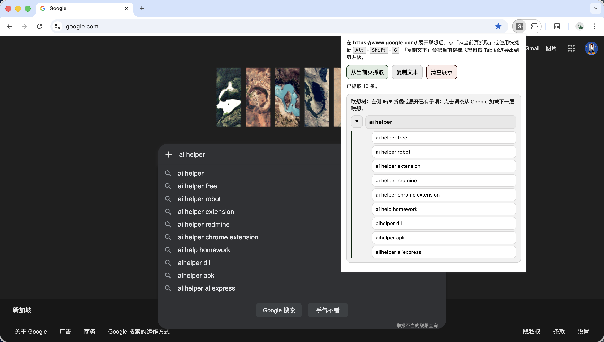
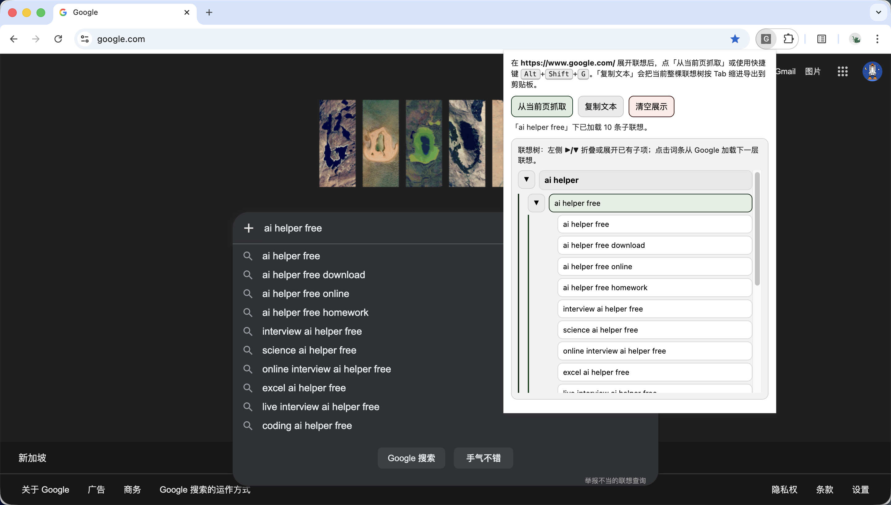
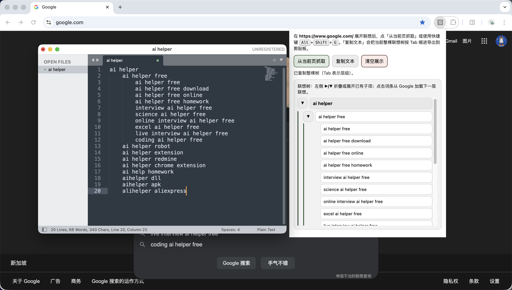

Google autocomplete mining

Google 自动补全挖掘，是最简单的免费关键词研究方法！

## 安装（Chrome）

1. 打开 `chrome://extensions`
2. 开启「开发者模式」
3. 点击「加载已解压的扩展程序」，选择本仓库的 `extension` 目录，加载即可。

## 使用步骤

1. 打开 [Google 首页](https://www.google.com/)，在搜索框输入一个种子词，例如 `ai helper`。
2. 点击浏览器右上角「扩展程序」图标，打开「Google 联想抓取」插件。
3. 在插件弹窗中点击「从当前页面抓取」，即可抓取当前搜索词的联想词条。
4. 词条会以树形结构展示。你可以在插件中继续点击任意词条，插件会自动回填到搜索框，并抓取下一层联想结果。
5. 完成后点击「复制文本」，即可复制整棵联想树（Tab 缩进格式），粘贴到任意文本工具中继续整理。

## 操作效果图

### 1）在搜索框输入种子词，点击「从当前页抓取」按钮

### 2）在插件中，点击联想词条，会自动回填到输入框并抓取

### 3）复制整棵树形扩展词

## 说明

- 所有抓取与导出均在本地完成，不上传到服务器。
- 建议从 1~2 个核心词开始，逐层点击扩展，可快速得到结构化关键词树。
- Google 官方也提供 API 接口；本插件不调用 API，而是在浏览器里操作当前页面、读取页面上展示的联想结果。
